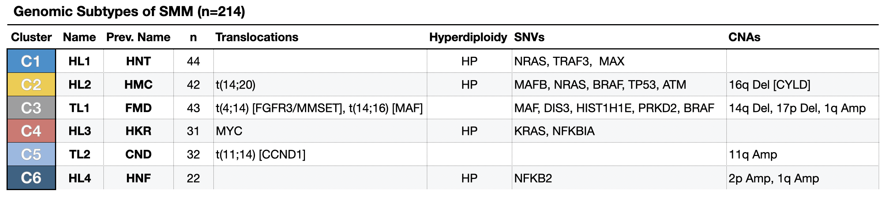

# SMM Clustering 2020

Repo for Manuscript:

**Genetic Subtypes of Smoldering Multiple Myeloma are associated with Distinct Pathogenic Phenotypes and Clinical Outcomes**

[Link](https://www.biorxiv.org/content/10.1101/2021.12.10.471975v1) to pre-print.

Contact: Shankara Anand - sanand@broadinstitute.org

Table of DNA-based SMM subtypes

_Note: we included in this table the names used in previous iterations and seen in the code base._

---
**Repo Structure**:

`data` - see `./data/README.md`

`funcs` - folder with python/R helper functions or scripts written

`Fig1`
* `1_clustering.ipynb`: notebook with clustering, QC, fisher exact tests for DNA features
* `2_misc.ipynb`: misc cohort plots
* `3*_mutational_signatures.ipynb`: mutational signature analysis with subtypes

`Fig2`
* `1_process_rna.ipynb`: python notebook describing RNA processing & QC
* `2_diffexp_pathways_rna.ipynb`: R notebook with differential expression, fGSEA, & other plots for Fig2 & related supplements

`Fig3`
* `1_clinical_classifier.ipynb`: subtype classifier for clinical outcomes
* Run `00-fig-km.R`, `01-fig-traj.R`, then `02-fig-pairs.R`
